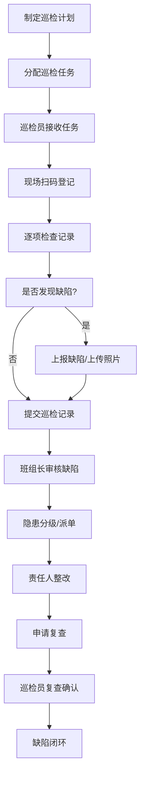
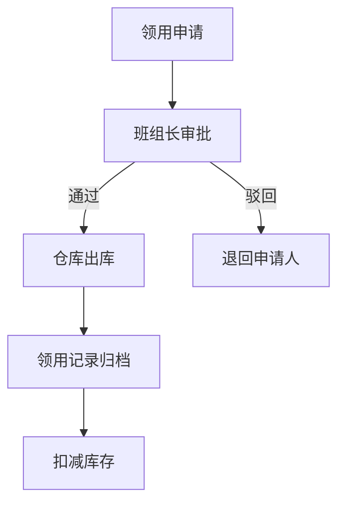

## 1. 产品概述

铁路设备巡检 Web 平台是服务于铁路工务、电务、供电班组的专业巡检管理系统。平台实现巡检计划制定、现场执行、缺陷闭环、设备管理、备件管理及绩效评价的全流程数字化管理，提升设备巡检效率和设备安全运行保障能力。

- 核心目标：实现铁路设备巡检全流程数字化、标准化、智能化，保障铁路安全高效运行。
- 目标用户：工务班组、电务班组、供电班组巡检人员及管理人员。

## 2. 核心功能

### 2.1 用户角色

| 角色 | 注册方式 | 核心权限 |
|------|----------|----------|
| 巡检员 | 系统分配账号 | 执行巡检任务、扫码登记、上传照片、上报缺陷、查看任务 |
| 班组长 | 系统分配账号 | 制定巡检计划、派工、审批、查看班组绩效 |
| 管理员 | 系统分配账号 | 设备档案管理、备件管理、统计评价、系统配置 |

### 2.2 功能模块

1. **首页看板**：综合数据概览、待办任务、超期提醒、风险趋势
2. **巡检计划**：计划列表、计划排期、路线管理
3. **任务执行**：任务列表、扫码登记、照片上传、巡检记录
4. **缺陷管理**：隐患分级、整改派单、复查确认、超期提醒
5. **设备档案**：设备列表、设备履历、维修记录归档
6. **备件领用**：备件库存、领用申请、审批流程、库存提醒
7. **统计评价**：班组绩效、风险趋势、巡检完成率、缺陷统计

### 2.3 页面详情

| 页面名称 | 模块名称 | 功能描述 |
|----------|----------|----------|
| 首页看板 | 数据概览 | 展示关键指标卡片（待办任务数、今日巡检数、待整改缺陷数、设备总数） |
| 首页看板 | 待办任务 | 列表展示当前用户待处理的任务和缺陷 |
| 首页看板 | 超期提醒 | 红色醒目展示超期未处理的任务和缺陷 |
| 首页看板 | 风险趋势 | 折线图展示近30天缺陷数量趋势 |
| 首页看板 | 线路设备分布 | GIS地图展示线路和设备分布 |
| 巡检计划 | 计划列表 | 表格展示所有巡检计划，支持筛选搜索 |
| 巡检计划 | 计划排期 | 日历视图展示计划安排，支持拖拽调整 |
| 巡检计划 | 路线管理 | 配置巡检路线、站点、检查项配置 |
| 任务执行 | 任务列表 | 展示分配给当前用户的巡检任务 |
| 任务执行 | 扫码登记 | 模拟扫码功能，登记设备检查结果 |
| 任务执行 | 照片上传 | 支持巡检现场照片上传和预览 |
| 任务执行 | 离线补录 | 支持离线状态下记录数据，联网后同步 |
| 缺陷管理 | 缺陷列表 | 展示所有缺陷，支持按等级、状态筛选 |
| 缺陷管理 | 隐患分级 | 一般/较大/重大三级分级标识 |
| 缺陷管理 | 整改派单 | 指定整改责任人、整改期限 |
| 缺陷管理 | 复查确认 | 整改完成后复查验证，闭环管理 |
| 设备档案 | 设备列表 | 线路设备分类展示，支持搜索筛选 |
| 设备档案 | 设备履历 | 设备基本信息、巡检历史、维修记录 |
| 设备档案 | 维修记录归档 | 历史维修记录查询和归档 |
| 备件领用 | 备件库存 | 备件分类库存展示，低库存提醒 |
| 备件领用 | 领用申请 | 填写领用申请，选择备件和数量 |
| 备件领用 | 领用审批 | 班组长/管理员审批领用申请 |
| 统计评价 | 班组绩效 | 各班组巡检完成率、缺陷整改率排名 |
| 统计评价 | 风险趋势 | 按时间维度展示缺陷变化趋势 |
| 统计评价 | 巡检统计 | 巡检任务完成情况统计分析 |
| 统计评价 | 缺陷统计 | 缺陷类型、等级、处理状态统计 |

## 3. 核心流程

### 3.1 巡检主流程

巡检员登录系统后，查看分配的巡检任务，到达现场扫码登记设备，逐项检查并记录结果，发现缺陷即时上报，上传现场照片。完成任务后提交。班组长查看缺陷，进行分级和派单，整改责任人接收任务进行整改，完成后申请复查，巡检员复查确认闭环。

### 3.2 备件领用流程

巡检员提交备件领用申请，班组长审批，审批通过后仓库管理员出库，领用记录归档。

## 4. 用户界面设计

### 4.1 设计风格

- **主色调**：深蓝色 (#1E40AF) 作为主色，代表专业、可靠、稳重，符合铁路行业特性
- **辅助色**：橙色 (#F97316) 用于强调和警示，绿色 (#10B981) 表示正常/通过，红色 (#EF4444) 表示危险/超期
- **中性色**：深灰 (#1F2937) 用于文字，中灰 (#6B7280) 用于次要文字，浅灰 (#F3F4F6) 用于背景
- **按钮样式**：圆角 8px，主按钮深蓝色填充，悬停时加深，有微妙阴影效果
- **字体**：系统字体栈，优先使用微软雅黑/PingFang SC，保证中文显示清晰
- **布局风格**：左侧导航栏 + 顶部状态栏 + 主内容区，卡片式布局，信息分组清晰
- **图标风格**：线性图标，统一 24px 尺寸，保持简洁专业

### 4.2 页面设计概览

| 页面名称 | 模块名称 | UI 元素 |
|----------|----------|---------|
| 首页看板 | 数据概览 | 4个统计卡片横向排列，带渐变背景和图标，数值动画效果 |
| 首页看板 | 待办任务 | 列表卡片，任务状态标签，操作按钮 |
| 首页看板 | 风险趋势 | ECharts 折线图，渐变填充区域 |
| 首页看板 | 线路分布 | 简化线路示意图，设备点位标记 |
| 巡检计划 | 计划列表 | 数据表格，行悬停高亮，操作列 |
| 巡检计划 | 计划排期 | 月视图日历，计划块彩色标记 |
| 任务执行 | 任务卡片 | 卡片式列表，进度条，扫码按钮 |
| 任务执行 | 检查表单 | 分步表单，逐项检查，支持拍照上传 |
| 缺陷管理 | 缺陷列表 | 按等级色标标识，状态流转按钮 |
| 缺陷管理 | 缺陷详情 | 时间线展示处理流程，照片轮播 |
| 设备档案 | 设备列表 | 分类侧边栏 + 主列表，搜索筛选栏 |
| 设备档案 | 设备详情 | Tab 切换（基本信息/巡检历史/维修记录） |
| 备件领用 | 库存列表 | 卡片网格，库存数量色标（正常/预警/不足） |
| 统计评价 | 图表区 | 多种图表组合（柱状图/饼图/折线图） |

### 4.3 响应式设计

- 桌面端优先设计，适配 1366px 及以上分辨率
- 平板端：导航栏收起为图标模式，内容区自适应
- 移动端：底部导航栏，卡片堆叠布局，优化触摸交互区域
- 支持移动端填报，优化表单输入体验
- 离线补录功能，支持无网络环境下的数据暂存

### 4.4 动效设计

- 页面切换：淡入 + 轻微上移动画，200ms 缓动
- 卡片悬停：上移 2px + 阴影加深
- 数据加载：骨架屏占位，内容渐显
- 状态变化：颜色过渡动画
- 通知提醒：右上角滑入，轻微弹跳
