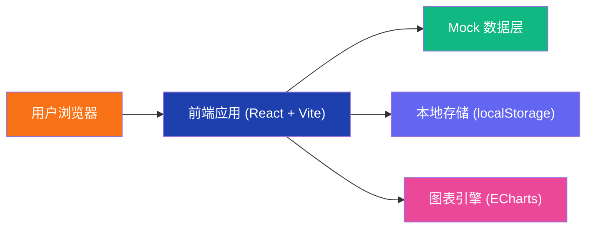
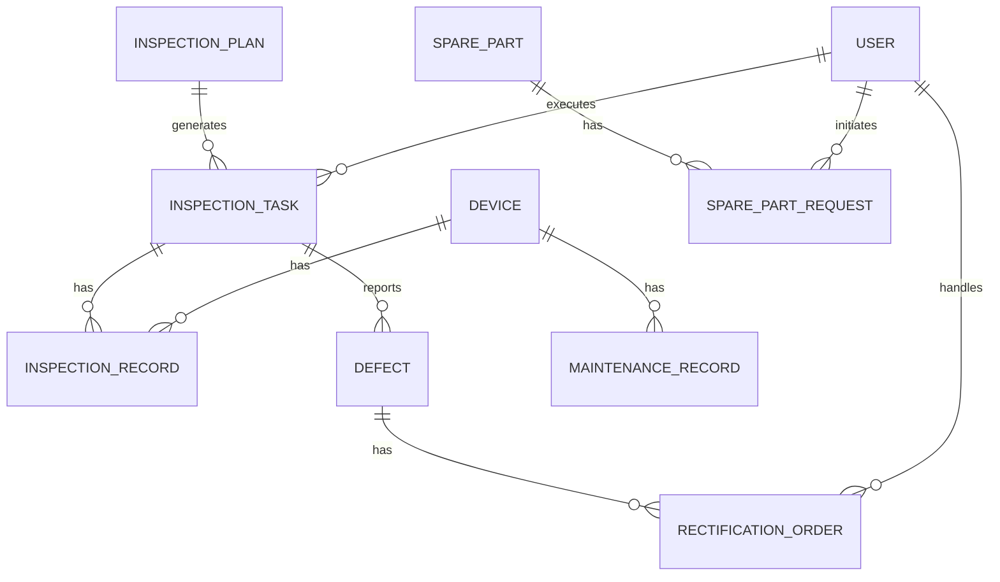

## 1. 架构设计



## 2. 技术描述

- **前端框架**：React@18 + TypeScript
- **构建工具**：Vite@5
- **样式方案**：TailwindCSS@3
- **UI 组件库**：Lucide React（图标）
- **图表库**：ECharts@5
- **路由**：React Router@6
- **状态管理**：React Context + useReducer
- **本地存储**：localStorage（模拟离线数据）
- **数据模拟**：前端 Mock 数据，无真实后端

## 3. 路由定义

| 路由 | 页面 | 用途 |
|------|------|------|
| / | 首页看板 | 综合数据概览、待办任务、风险趋势 |
| /plans | 巡检计划 | 计划列表、排期日历、路线管理 |
| /tasks | 任务执行 | 任务列表、扫码登记、检查记录 |
| /defects | 缺陷管理 | 缺陷列表、分级派单、复查确认 |
| /devices | 设备档案 | 设备列表、设备履历、维修记录 |
| /spare-parts | 备件领用 | 备件库存、领用申请、审批 |
| /statistics | 统计评价 | 班组绩效、风险趋势、数据统计 |

## 4. 目录结构

```
src/
├── components/          # 公共组件
│   ├── Layout/         # 布局组件（侧边栏、顶部栏）
│   ├── common/         # 通用组件（卡片、表格、表单）
│   └── charts/         # 图表组件
├── pages/              # 页面组件
│   ├── Dashboard/      # 首页看板
│   ├── Plans/          # 巡检计划
│   ├── Tasks/          # 任务执行
│   ├── Defects/        # 缺陷管理
│   ├── Devices/        # 设备档案
│   ├── SpareParts/     # 备件领用
│   └── Statistics/     # 统计评价
├── context/            # 状态管理
├── data/               # Mock 数据
├── types/              # TypeScript 类型定义
├── utils/              # 工具函数
├── App.tsx
├── main.tsx
└── index.css
```

## 5. 数据模型

### 5.1 实体关系



### 5.2 核心数据类型

```typescript
// 用户
interface User {
  id: string;
  name: string;
  role: 'inspector' | 'leader' | 'admin';
  team: string;
  avatar?: string;
}

// 巡检计划
interface InspectionPlan {
  id: string;
  name: string;
  type: 'daily' | 'weekly' | 'monthly';
  routeId: string;
  startDate: string;
  endDate: string;
  assignees: string[];
  status: 'draft' | 'active' | 'completed';
  createdAt: string;
}

// 巡检任务
interface InspectionTask {
  id: string;
  planId: string;
  name: string;
  routeId: string;
  assigneeId: string;
  scheduledDate: string;
  status: 'pending' | 'in_progress' | 'completed' | 'overdue';
  progress: number;
  startedAt?: string;
  completedAt?: string;
}

// 设备
interface Device {
  id: string;
  name: string;
  code: string;
  type: string;
  line: string;
  location: string;
  installDate: string;
  status: 'normal' | 'warning' | 'fault';
  lastInspectionDate?: string;
  nextInspectionDate?: string;
}

// 缺陷
interface Defect {
  id: string;
  taskId: string;
  deviceId: string;
  title: string;
  description: string;
  level: 'minor' | 'major' | 'critical';
  status: 'reported' | 'assigned' | 'rectifying' | 'rechecking' | 'closed';
  photos: string[];
  reporterId: string;
  assigneeId?: string;
  deadline?: string;
  createdAt: string;
  rectificationDesc?: string;
  recheckResult?: string;
}

// 备件
interface SparePart {
  id: string;
  name: string;
  code: string;
  category: string;
  stock: number;
  minStock: number;
  unit: string;
  location: string;
}

// 备件领用申请
interface SparePartRequest {
  id: string;
  partId: string;
  quantity: number;
  applicantId: string;
  reason: string;
  status: 'pending' | 'approved' | 'rejected';
  approverId?: string;
  createdAt: string;
}
```

## 6. 技术选型说明

### 6.1 核心技术栈选择理由

- **React + TypeScript**：保证代码质量和可维护性，适合中大型项目
- **Vite**：快速的开发体验和构建效率
- **TailwindCSS**：高效的样式开发，统一的设计语言
- **ECharts**：功能强大的图表库，满足复杂的数据可视化需求
- **Lucide React**：轻量级、美观的图标库

### 6.2 无后端设计说明

本项目采用纯前端实现，使用 Mock 数据模拟后端接口：
- 数据持久化使用 localStorage
- 模拟网络延迟增加真实感
- 所有数据操作在前端完成
- 便于演示和快速原型验证

### 6.3 离线功能实现

- 使用 localStorage 存储待同步数据
- 监听网络状态变化
- 联网时自动同步离线数据
- 提供数据同步状态指示器
